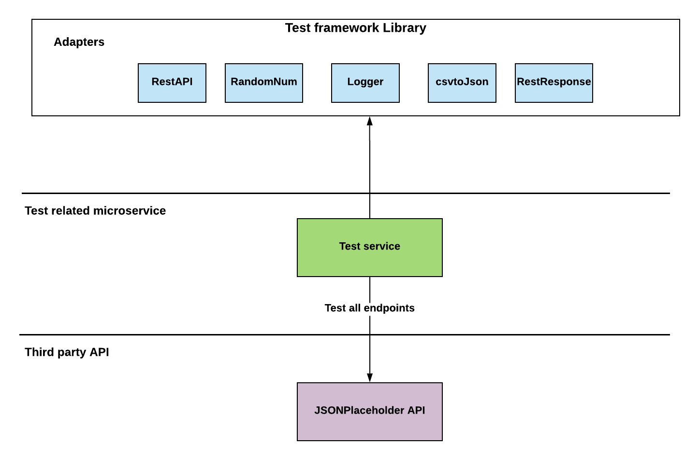

# Full-rest-api-test
### Overview
This service tests the [JSONPlaceholder](http://jsonplaceholder.typicode.com/) API, including the following endpoints:

- GET	/posts
- GET	/posts/{Id}
- GET	/posts/1/comments
- GET	/comments?postId={Id}
- GET	/posts?userId={Id}
- POST	/posts
- PUT	/posts/{Id}
- PATCH	/posts/{Id}
- DELETE	/posts/{Id}

Observations of the **JSONPlaceholder API** during testing:

- The DELETE /posts/{Id} returns 200 and not 204, which deviates from REST principles as a DELETE endpoint returns no content in the response body.
- Test data provided to the POST, PUT and PATCH endpoints are not persisted.
- There is no validation implemented in the backend as it accepts data that deviates from the expected request payload schema and also that the user is unable to carry out testing endpoint validation (i.e. invalid request payload).

## Test service

The daigram below shows an architectural overview of the test service.

The *adapters* are developed to reduce code duplication
The *config* includes the rool URL of the API being tested.
Log is used for stack trace purposes. The *test service* makes use of the adapters and contains logic that tests *JSONPlaceholder API* endpoints.

Below is the folder structure of the service:

    .
    ├── .circleci
    ├── mochawesome-report
    ├── test
    	├── adapters
    	├── config
    	├── testdata
    	├── run.js
    ├── .gitignore
    ├── docker-compose.yml
    ├── Dockerfile
    ├── Makefile
    ├── package.json
    ├── README.md                    # readme file
    └── ...
    

### Requirements
* Node.js
* npm

## Installation
Install ***node.js*** and ***npm*** from the below link:

[https://nodejs.org/en/download]()

#### Create dependency package
	$ npm init
	
#### Install dependencies in a terminal 
`$ npm install supertest --save`

`$ npm install chai --save`

`$ npm install mocha --save`

`$ npm install body-parser --save`

`$ npm install mocha-junit-reporter --save`

`$ npm install mocha-html-reporter --save`

`$ npm install convert-csv-to-json --save`

#### Install dependencies using the makefile (alternative installation of dependencies)
Ensure that you're in the root of the service

`$ cd full-rest-api-test`

`$ make deps`

#### Run the API tests
`$ npm test`

`$ mocha test/run.js --reporter mochawesome`

`$ mocha testdata` - run data driven tests

Run the tests from the Makefile

`$ make all`

To view the Test report, run the following command
`$ open mochawesome-report/mochawesome.html`

#### Run the API tests inside a docker container

`$ docker-compose build && docker-compose up`
`$ docker-compose logs` - To see the results in the last ran docker container